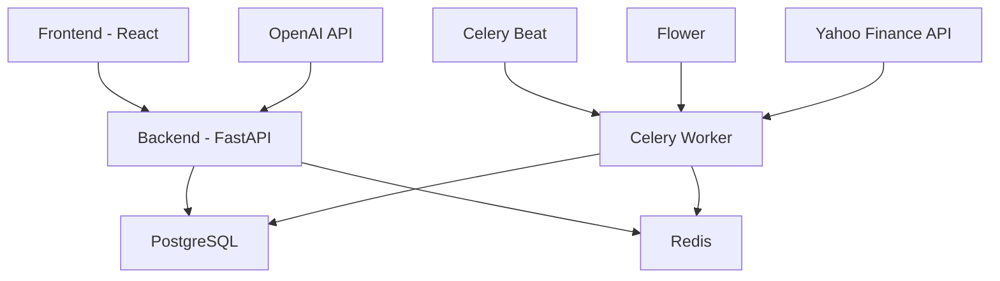

# Financial Management Application

A comprehensive financial management application with real-time market data integration and AI-powered insights.

## Features

### Core Functionality
- User account management
- Transaction tracking and categorization
- Financial analytics and reporting
- RESTful API with FastAPI
- Modern React frontend with Material-UI

### Market Data Integration
- Real-time market data fetching from Yahoo Finance
- Support for stocks (AAPL, MSFT, GOOGL, AMZN) and cryptocurrencies (BTC-USD, ETH-USD)
- Historical data storage and retrieval
- Daily automated data updates

### AI Integration
- AI-powered financial insights using OpenAI
- Transaction analysis and categorization
- Personalized financial advice
- Extensible AI assistant architecture (supports OpenAI, with easy integration for Claude, Gemini, etc.)

### Task Automation
- Celery task queue integration
- Scheduled daily market data updates
- Automated transaction notifications
- Monthly financial summaries

### Monitoring and Management
- Flower dashboard for task monitoring
- Redis for caching and task queue
- PostgreSQL for data persistence
- Docker containerization for all services

## Tech Stack

- **Backend**: FastAPI, Python 3.11
- **Frontend**: React, Material-UI
- **Database**: PostgreSQL 15
- **Cache & Queue**: Redis 7
- **Task Queue**: Celery 5.3
- **Task Monitor**: Flower 2.0
- **Container**: Docker & Docker Compose
- **Market Data**: Yahoo Finance API
- **AI Integration**: OpenAI API

## API Endpoints

### User Management
- POST `/users/` - Create new user
- GET `/users/{user_id}` - Get user details

### Transactions
- POST `/users/{user_id}/transactions/` - Create transaction
- GET `/users/{user_id}/transactions/` - List user transactions
- GET `/transactions/{transaction_id}` - Get transaction details
- PUT `/transactions/{transaction_id}` - Update transaction
- DELETE `/transactions/{transaction_id}` - Delete transaction

### Market Data
- GET `/market-data/latest/{symbol}` - Get latest market data
- GET `/market-data/historical/{symbol}` - Get historical data
- POST `/market-data/fetch` - Manually trigger data fetch

## Setup Instructions

### Prerequisites
- Docker and Docker Compose
- OpenAI API key (for AI features)

### Environment Variables
Create a `.env` file with:
```
POSTGRES_USER=postgres
POSTGRES_PASSWORD=password
POSTGRES_DB=finance_db
OPENAI_API_KEY=your_openai_api_key_here
```

### Running the Application

1. Clone the repository:
```bash
git clone <repository-url>
cd <repository-name>
```

2. Start the services:
```bash
docker-compose up --build
```

3. Access the services:
- Frontend: http://localhost:3000
- Backend API: http://localhost:8000
- API Documentation: http://localhost:8000/docs
- Flower Dashboard: http://localhost:5555

### Development Setup

1. Install backend dependencies:
```bash
pip install -r requirements.txt
```

2. Install frontend dependencies:
```bash
cd frontend
npm install
```

3. Run development servers:
```bash
# Backend
uvicorn app.main:app --reload

# Frontend
npm start
```

## Architecture



## Project Structure
```
.
├── app/
│   ├── assistant/
│   │   ├── __init__.py
│   │   ├── base.py
│   │   └── openai_assistant.py
│   ├── services/
│   │   └── market_data.py
│   ├── __init__.py
│   ├── main.py
│   ├── models.py
│   ├── schemas.py
│   ├── database.py
│   └── celery_app.py
├── frontend/
│   ├── src/
│   ├── package.json
│   └── Dockerfile
├── requirements.txt
├── Dockerfile
├── docker-compose.yml
└── README.md
```

## Contributing

1. Fork the repository
2. Create a feature branch
3. Commit your changes
4. Push to the branch
5. Create a Pull Request

## License

This project is licensed under the MIT License - see the LICENSE file for details. 